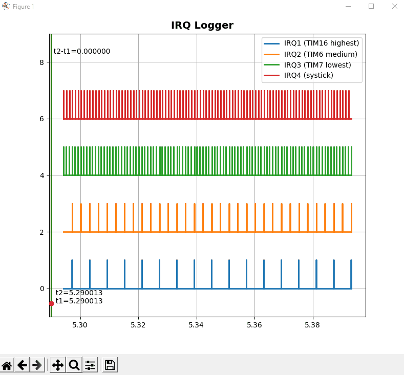

# STM32 interrupt logger (IRQ logger)

A simple, minimalistic tool to diagnose interrupts execution times without anything else than an ST-LINK programmer

"s" ([S>G](https://www.screentogif.com/)) 

